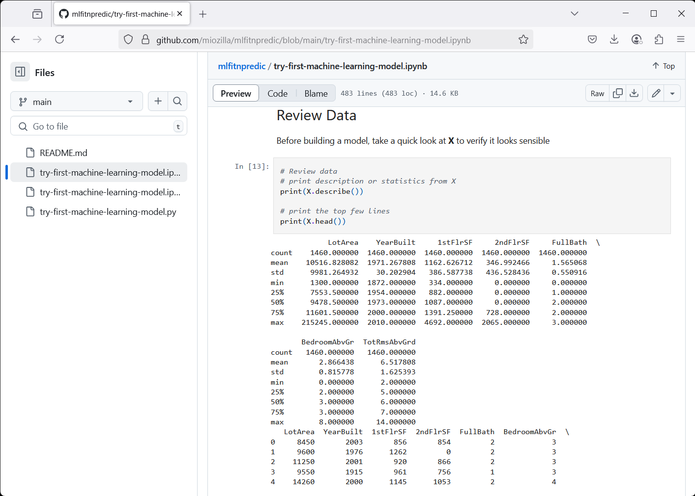
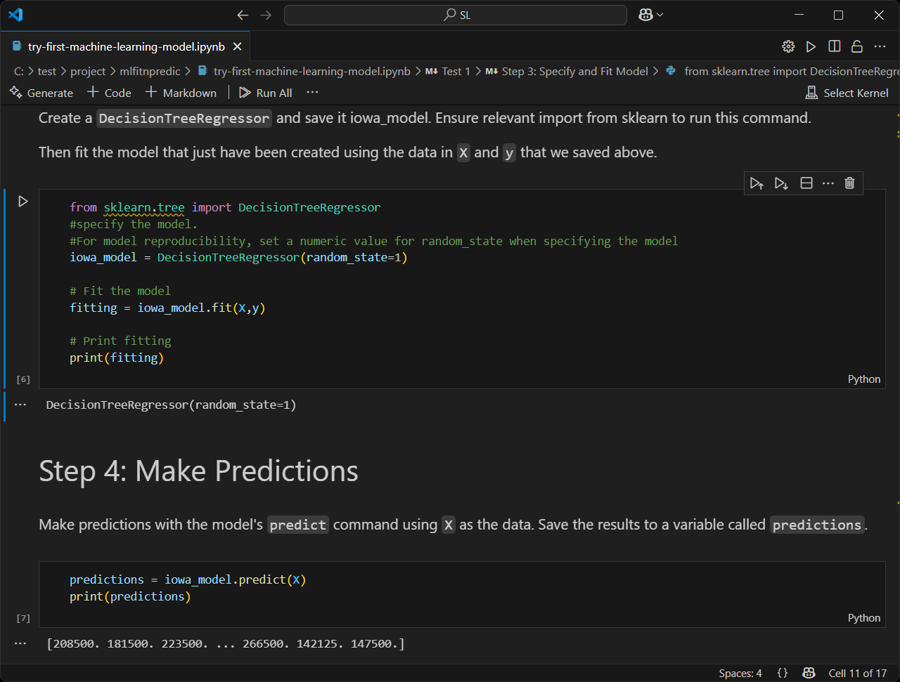

# mlfitnpredic
Machine Learning (ML) Model Building.

## Objective

To proof model training (fitting and prediction).  Using regression tasks to predict continuous values (e.g., housing prices).

## Features

- **Model**: DecisionTreeRegressor from sklearn.tree.
- **Dataset**: House Prices.

## Getting Started

To get started with Model Building, follow these steps:

[Get Start](https://github.com/miozilla/mlfitnpredic/blob/main/try-first-machine-learning-model.ipynb)

